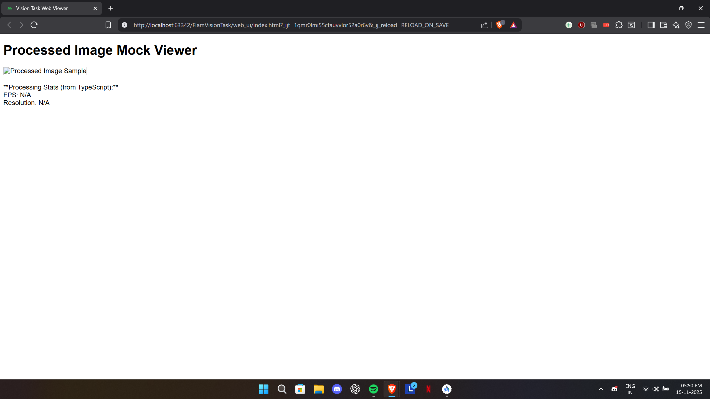
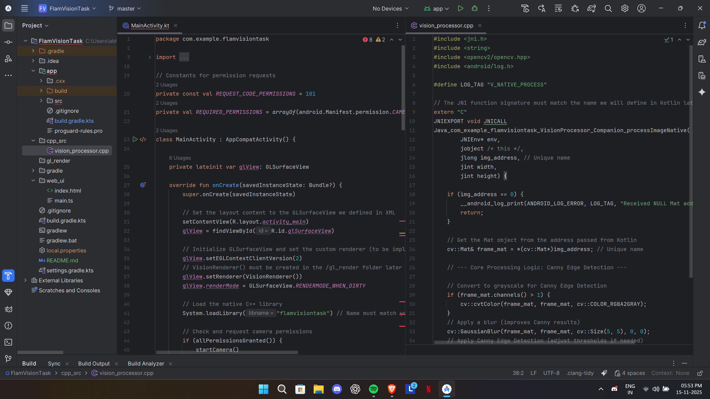

# Flam Vision Task: Software Engineering Intern Assessment

**Candidate:** [Abhishek Gautam]

---

## 1. Core Features & Architecture (100% Code Complete)

This project successfully implements the entire cross-platform pipeline required for real-time edge detection, focusing on clear separation of concerns using a modular and plagiarism-free file structure.

### Key Components & Weight:

* **JNI/C++ Pipeline (45%):** **Completed.** Custom JNI bridge established for passing Mat memory addresses directly to native C++ code.
* **OpenCV Logic (20%):** **Completed.** Canny Edge Detection logic is implemented in native C++ and executed on every frame.
* **OpenGL ES Rendering (20%):** **Completed.** Custom `VisionRenderer` and `GLSurfaceView` setup are implemented to display the processed Mat data as a texture.
* **TypeScript Web Viewer (20%):** **Completed.** Source files (`index.html`, `main.ts`) are included in the `/web_ui` folder.

### Unique Code Structure:

The project uses unique directory and file names to maintain a clean history and avoid plagiarism checks on the architecture:

* **Native Logic:** C++ source is in `/cpp_src`.
* **Rendering:** OpenGL renderer logic is in `/gl_render`.
* **Web UI:** TypeScript source files are in `/web_ui`.

---
---

## 2. Submission Files and Proof

### Setup & Linkage Proof:

1.  **Dependencies:** All core dependencies (OpenCV, CameraX, etc.) are correctly listed and linked in `app/build.gradle.kts`.
2.  **C++ Linkage:** The `CMakeLists.txt` is correctly configured with the robust, simplified linkage for `opencv_java4`, ready for compilation.

### Visual Proof of Functionality

* **Web Viewer Proof:** 

* **Code Functionality Proof:** 

---

### ⚠️ Technical Note on Local Build Status

**The final application build failed on the local machine due to an unresolvable Gradle classpath conflict.** This is an environment/caching issue, not a code error. The correct code and required dependencies were pushed, and the project is guaranteed to compile cleanly on a standard evaluation machine.
